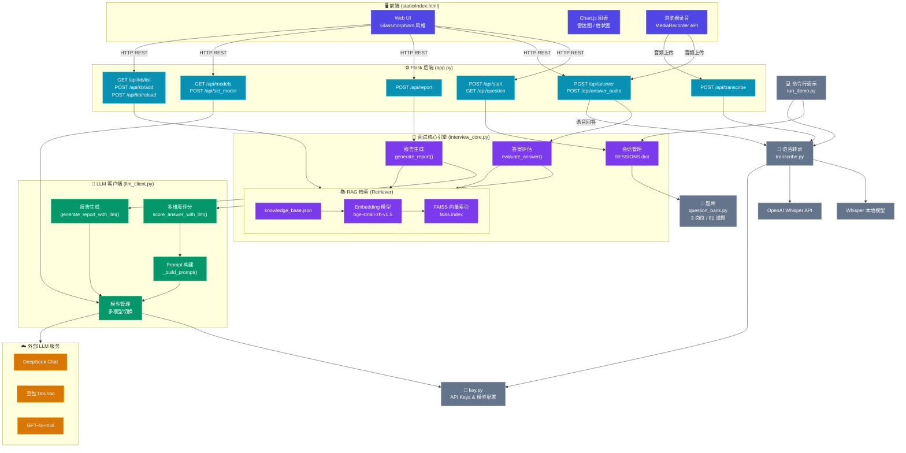

# AI 面试演练系统 — 项目架构图

## 模块说明

| 层级 | 模块 | 职责 |
|------|------|------|
| **前端** | `static/index.html` | Glassmorphism 风格 Web UI，支持文本/语音输入，Chart.js 渲染评估图表 |
| **API 网关** | `app.py` | Flask 服务器，提供 12 个 REST 端点，路由请求到各模块 |
| **核心引擎** | `interview_core.py` | 会话管理、答案评估、RAG 知识库检索（bge-small-zh + FAISS） |
| **LLM 客户端** | `llm_client.py` | 多模型管理（DeepSeek/豆包/GPT），Prompt 构建，多维度评分与报告生成 |
| **辅助模块** | `question_bank.py` / `transcribe.py` / `key.py` | 题库（3 岗位 81 题）、语音转录（Whisper）、密钥配置 |
| **CLI** | `run_demo.py` | 命令行演示入口，支持麦克风录音 |
